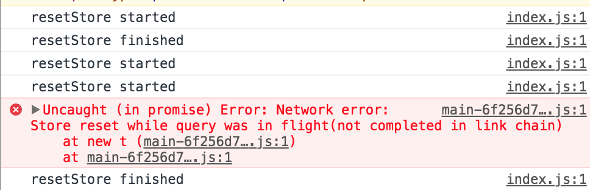

# Bug report #3555 of apollographql/apollo-client

This project is based on the work found at [next.js' with-apollo-auth example](https://github.com/zeit/next.js/tree/canary/examples/with-apollo-auth)

# The problem

`apollo.resetStore()` hangs forever on the second time it's called and throws `Store reset while query was in flight(not completed in link chain)` errors on successive calls.

## Demo

https://resetstore-bug-khorpkwmii.now.sh

# Steps to reproduce

1. Open https://resetstore-bug-khorpkwmii.now.sh or run this project locally.
2. Login (you can use `bug@report.apollo` as both email and pass 😉)
3. Logout. The logs will contain only 3 entries, instead of 4:
  * resetStore started
  * resetStore finished
  * resetStore started
4. Login again. The `Store reset while query was in flight(not completed in link chain)` error will be thrown.
5. You can try reloading the page and then restart the process, now logged in. The same behaviour will be seen.

# Considerations

This issue only occurs when there are nested queries in the page.
The `MeBox` component contains a `Query` that will render the `Network` component once the user data is loaded. Inside `Network` there is also a `Query`, and that seems to be the origin of the error.

Commenting out `Network` at `components/MeBox.js:39` makes the bug disappear.